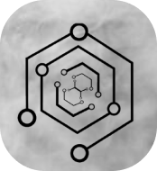

# Cooperation

Product of Initiative Group.
Slide "Cooperation".

## Table of contents

-   [Brief explanasion](#br-expl)
-   [Product description](#prod-descr)
-   [About us](#about-us)
    -   [Other our projects](#other-our)
-   [License, copyright](#lic-and-cop)

---

## Brief explanasion

Page "Cooperation" (Співпраця) of the Initiative Group's site.

## Product description

This is the our site. We are the Initiative Group.

## About us

We are the initiative group, of almost students.

More: on page ['about us' (ua)](https://www.initiative-group.out-site.com/about-us).

### Our projects

&lt;Nothing to show is.&gt;

See the page ['projects' (ua)](https://www.initiative-group.out-site.com/projects).

## License and the copyright

Is licensed under the [GNU GPL v3.0](http://choosealicense.com/licenses/gpl-3.0/).

---

&copy; Copyright Initiative Group, 2022

All rights reserved.

[up to top](#top)
